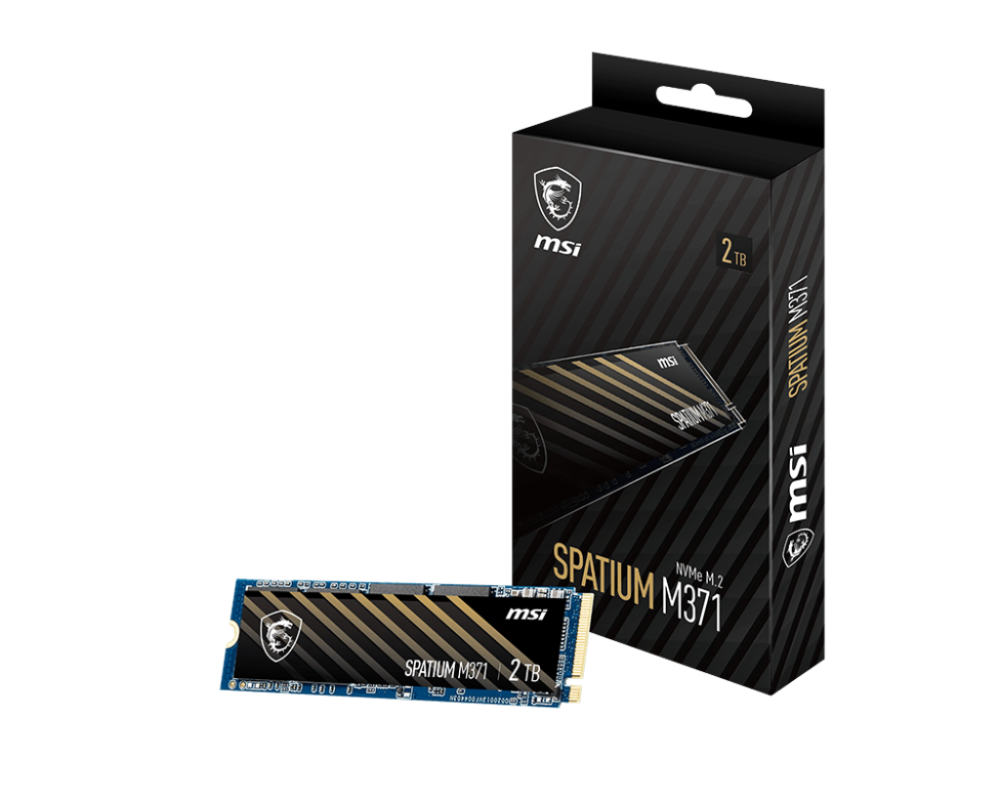

# 2023-0824.md

2023/08/24 SSD/NVMe の障害確認

去年（2022年）末ごろから使用しているSSDの不調が多くなった。その中の最初の1台は、フォーマットやディスクパーティションを切り直しても、CHKDSK のエラーが治らないため故障が確定し、保証期間内だったので新品交換で対応して貰った。
その後今年になって3台、問題が発生したためこの記事を書いた。

SSD/NVMe の障害確認
https://answers.microsoft.com/ja-jp/windows/forum/all/ssdnvme/bfaa7222-320d-4a58-a50b-1a0ec220458a

## 不具合対策で重要なこと

重要なことを先に記す。
「修復実験中」と前記記事で指摘したうちの1台、CrusialのSSDはその後のフォーマットし直しやメーカー製ツールの実行で、故障が確定した。しかし何と、その時は保証期間の5年を1か月過ぎていたことが判明した。
修復実験を始めたときはまだ、5年の保証期間内だった。
教訓として、SSDが不調になったらば、まず保証期間を確認して、それに合わせた対応が必要であると指摘する。

残り2台はフォーマットし直し等をして、Windows の再インストールで完璧に正常動作する様になった。
記事で指摘の通り、いずれもCrystalDiskInfoで異常が報告されていなかったので、当然と言えば当然である。

もう一つの教訓は、このCrystalDiskInfoが正常な件も含めて、各機種によって不具合時の挙動が様々なので、どの様に対処すれば良いのかが不明で決まっていない点である。
SSDはこれまでのほぼ同じ構造のメカの塊だったこれまでのHDDとは異なり、半導体のチップで、メーカーや型式によって構造や特性が異なるため、不具合も、そしてそれが治った場合の理由も仕組みもわからない。
これらのSSD不具合対策の経験をなるべく整理してまとめたのが、この記事である。

## 記事読者の指摘

この記事公開後、約4000台のPCの面倒を見ているという、[七辻屋 さん](https://answers.microsoft.com/ja-jp/profile/095a2ce4-7fde-4973-a345-cfbd6784154f) から、
SSDの障害はマザーボードから認識されなくなる「Hard Drive Not installed」が多いことが多いとの指摘。 
さらにCHKDSK は WindowsPE で実行して、途中で異常しても４～５回実行すると何とか終わる場合がある。
それで治らない場合、pagefile.sys 等を削除して実行すると成功する事があるとの事だ。

私の場合は、不具合発見時は CHKDSK は勿論、早目にフォーマットや、パーティション削除や再作成を実行しているので、結果的にはファイル削除の対応方法と似た様な修復効果があるのかも知れない。

## 特定機種の M.2 の問題

これらの件とは別に、新品で購入した同型の M.2 SSDが、特定のマザーボードの UEFI BIOSからほとんどの場合で認識されないか、または認識されてもWindows のインストール用のコピーが始まると、そこでエラーになるという問題を経験した。

問題が起きたメディアは、MSI SPATIUM M371 で、容量が異なる複数の製品を交換して問題を確認した。

原因はメディアとマザーボードとの相性問題である。
M.2 NVMe メディアは PCIeのデバイスであり、それに様々な世代、メーカーのマザーボードのUEFIファームウェアドライバーが個別対応する必要がある訳だが、MSIのこの製品の様に新しいメディア製品（チップ）だと少し古いUEFI BIOSが対応していない場合がある。
私の場合は、UEFI BIOS 更新でもまだBIOS側が対応していなかったので、マザーボード側をやり繰りして、何とかこの3台も買ってしまった M371を使いこなした。勿論、PCIe M.2 拡張ボードで使えるのはあたり前だが、それでは面白く無いのと、M.2 の速度が速いのでOSの中身を入れ替えた。いや正確には、現在はまだ M.2 NVMe に完全対応したドライブコピーツールは無いので、OSインストールをし直して対応した訳だ。

 
MSI SPATIUM M371 -- 対応環境では問題無く高速に動作している

