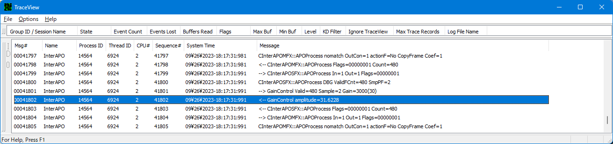

# 2023-1025.md

2023/10/25 WPPトレーシングの有効性を知らないか！

 
WPPトレーシング実行画面

先日、知り合いの会社から相談を持ち掛けられた。

## 古いVC++のソースコード

Visual Basic 6.0(VB6)と、Visual C++ 6.0 で記述された大規模なアプリケーションがアプリケーションがあり、それら再構成して近年の環境で動作させたいとのことだ。
西暦2000年頃はインターネットブームが流行り出し、世界中でアプリケーション開発者が増えて来た .NET 普及以前の「あの使い易い」VB6の案件である。

.NETとVB6については、世の中に多数の文献があるので置いといて、VC++やその後のVisual C++.NET 2002/2003 C++コンパイラには少しだけ苦しめられた経験があるので、記す。

前述の話を聞いてみると、いまだに Visual C++ 6.0 を使ってメンテナンスしていて、デバッグの収集が付かないとのことだ。
今の時代、Visual Studioの互換性には驚異的なものがあり、その様な古い環境を利用する必然性は無いばかりか不自由で得ることが無いので、早く最新のVisual Studio 2022に移行すべきだと指摘した。

仕事で3～4回程度、Visual C++.NET以前のアプリケーションのソースを近年の Viual Studio 2019やViual Studio 2022 への書き換えを経験したが、慣れると書き換えも容易になってくる。要点は、以下の3点。

１．この頃の VC++コンパイラー例えばforループ宣言のループ外の変数利用がエラーとはならない等の問題があり、それに起因するバグもありソースコードの全面見直しが必要。
しかし全てのその様な問題は、最近のコンパイラでは全てを指摘するので、早くコンパイル環境は更新である。

２．64bitアプリが登場し始めた Visual Studio 2005の頃には、いくつかのAPIとポインター定義が64bit対応に変更されたので、多くのコードの書き換えが必要だが、これもコンパイラが指摘するし、書き方のパターンがあるので、WSLの sed/awk でほとんどが書き換え可能である。

３．前項の該当部分を全て書き換えて、適切なコンパイルオプションを設定して最初のVisual Stuidioでビルドし直し、全てのエラーと警告に対応するとで、この様な20年以上前のコードも正常にビルド出来て、動作する。

## WPPトレーシングを使ってみよう

そして、インターフェース誌 Windows 11時代のデバイスドライバ開発連載の今月のテーマは、Windows APO オーディオドライバーのデバッグである。
ドライバーと言ってもこれのソースはユーザーモードで動作するOCX/COMであり、COMのデバッグに最適な機能を備える WPPトレーシングの活用は有効である。

http://www.devdrv.co.jp/hidaka/node/98

特に関数名、ソースファイル名、printf 同様の各種変数値は勿論、HRESULT値、GUID表記、クラス ID、インターフェイス ID、などの至れり尽くせりのVC++のデバッグに必要な値を容易に扱えることに、Windows がCOM/OCX ととも進化して来た歴史を垣間見ることが出来る。

しかも動作時の負荷がほとんどないため、オブジェクトコード中に埋め込んだまま、製品コードとして出荷することも可能である。
実際にカーネルモードのドライバーではその様な使い方を見かけるし、自分で使う。

WPP 拡張書式指定文字列とは
https://learn.microsoft.com/ja-jp/windows-hardware/drivers/devtest/what-are-the-wpp-extended-format-specification-strings-

GUIやコンソール画面を持つアプリケーションのデバッグにはあまり意味が無いかも知れないが、ユーザーモードでも導入するので、
記事で取り上げた、COM/OCX DLLは勿論、、サービスなどのコンソールを持たないアプリケーションのデバッグには有効なので、デバッグで悩んでいる、VC++を使っている人は、検討の価値がある。
