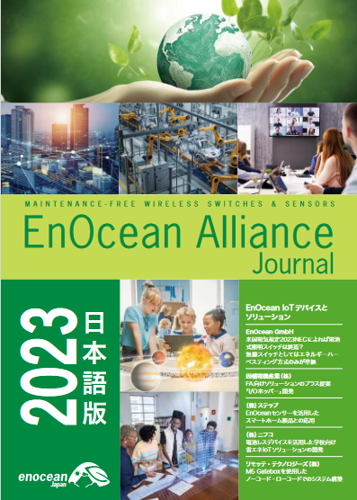

# 2023-1105.md

2023/11/05 EnOcean Journal とEnOcean Alliance日本イベント

11月1日は去年と同じく EnOcean Alliance日本イベントが羽田HiCity (HANEDA INNOVATION CITY) で開催されて参加して来た。

先日記事を寄稿した、EnOcean Alliance Journal も配布された。
弊社記事のChatGPT活用は40ページ掲載。

https://www.enocean-alliance.org/wp-content/uploads/2023/10/EnOcean_Alliance_Journal_2023_web_1018.pdf

弊社のセッションもこの内容で、短時間ながら、みっちりとプロンプトのやり取りを紹介しながら実演。

このセッションの資料はこちら。
https://www.slideshare.net/NETMF/chatgpt-solution-with-enocean-gateway

後日プロンプトを含めた全プログラムと出力結果を公開予定である。

なお生成AIブームにもかかわらず、生成AI応用の事例を発表したのは約20社発表のEnOcean Alliance日本イベントでも、またEnOcean Alliance Journal 2023年版の記事でも弊社だけで、少し驚いた。
