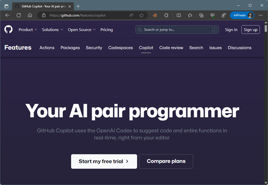

# 2023-1125.md

## 自動プログラミング機能という、GitHub Copilot を使ってみた。

まずCopilot（副操縦士）の名前だが、これは昔いた会社（富士ゼロックス）で使っていた、J-Star/Star のワークステーションオペレーティングシステムの名前だったので、馴染みがあり。よく覚えている。
J-Starは17インチ程度のモノクロディスプレイを持つ今のパソコンの原点とも言える製品で、インターネットのブラウザこそ無いものの、強力なワープロとインターネット・メール機能でオフィス業務をサポートすることが出来た。
1台3～400万円するその機械は、私が入社した1984年当時は3～4人に1台の割り当てだったが2年経たないうちに1人1台となり、やがてはSun-4やIBM-PCで同じシステムが動作した。その頃の利用者には馴染みがある呼称のはずだ。

## 取り組みのきっかけ

それはさておき、GitHub Copilot である。

昨年、2022年からGitHubでは、様々なオープンソースからのその学習内容を元に勝手にソースコードを提案してくる機能を「GitHub Copilot」としてVisual Studio 2022のプラグインで利用出来る様にして、「テクニカルプレビュー」として提供しはじめた。
当時はまだ評判もよく分からず、そこそこの人間プログラマーの方が優秀なのではないかと思い、評価しないままでいた。

しかし次の理由で導入を試してみることにした。

１．先日試した ChatGPT Advanced Data Analysis でのコード生成利用実績があまりにスムーズで、特にソースコード生成に関しては申し分無く「使える」と感じた。
２．Windowsドライバー開発での、AIソースコード生成機能利用という話はまだ聞いたことが無く、雑誌連載記事としても最適と考えた。
３．雑誌連載記事ではちょうど、Windowsオーディオドライバ－のサンプルで、音質制御機能をどの様に扱えばいいのかを思案中だった。

調べてみると、オーディオ・グラフィック・イコライザーは、Robert Bristow-Johnson‘s Cookbook による手法（BiQuadFilter、ハードウェア、ソフトウェア）が一般的である。しかしライセンスが明らかで、雑誌連載記事に相応しいソースコードがなさそうなことが判明した。

ということで、まず試しに音量（ゲインレベル）制御処理を作らせたところ、レベル表記の割合の扱いと変換計算の細かい問題はあったものの、ほぼ使えることがわかった。

そして、BiQuadFilter をコーディングさせた。
８種類のフィルターが考案されているうち、使うのは「ピーキングフィルター」だけなので、最初は使用するピーキングフィルターだけをコーディングさせ様としたが、勝手なコードを作りたがり、上手く動作しない。
この、こちらが「書かせたい事」と、AIがコーディングしたがる内容が異なるという感触は、先日の「ChatGPT Advanced Data Analysis」でのCSVの前処理作成で経験したことと同じと思った。

どうすればいいのかというと、やりたい様にやらせて「様子を見る」である。犬の散歩に似ている。
というわけで、どうやらヘッダー処理を含めたフル機能の「BiQuadFilter」をうちの犬が作りたがっていることが判明したので、「タブ・キー」を打ちっ放しで作らせたわけである。

重要な点はコンパイル・エラーが無い点だ。コードが出力された時、プログラムは完成している。その分、変数名は適切にする必要がある。
これはC++プログラムにおいて驚異的な点だ。

ただし人間も同じ面があるが、表示単位や倍率計算やオフセット計算は、概念の理解を含めて苦手な傾向があるので、 実機での動作確認は重要である。
勿論ソースコードレビューで発見することも可能だろうが、かえってデバッガーでの実機動作確認ぐらいは自分で実行して安心したいものである。

## 使いこなしのコツ

- アルゴリズムは全てを作らせる
- 必要部だけのコードだけの作成は不可能
- 必要があれば、手順を追って、または手順を分けて、作らせる。
- 試しに勝手にやらせてみて、何がしたいのかを確認
- 適切な関数名、変数名、コメントが重要（変数名の付け直しも有用）
- 納得が行くコードが出るまで何回も作らせる（作り直しに真実がある場合も）
- 単位系、表示系の「Copilotの勘違い」に注意
- コンパイルエラーは無い
- 出力完了＝完成 デバッグ不要
- 動作確認は重要

## 結論

というわけで、GitHub Copilot による自動コーディングは「他人にコーディングさせる」という、これまでとは違うプログラミングのノウハウが必要になるが、なかなか楽しい。
例えば、C++インクルードヘッダーを書かせると「そう定義するか！？」など、まさに相棒のコーディングに微笑ましくも感じるものだ。
豊富なコーディング経験者こそがAI にコーディングさせるべきだと感じた。つまりAI との知恵比べである。
決してAIは、プログラマーの代わりにプログラミングするのではなく、優秀なプログラマーの仕事を奪ったりもしないと確信した。
