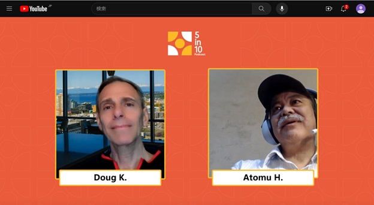

# 2023-1130.md

## Microsoft サポートコミュニティ 5 in 10 Podcast

MicrosoftSupportCommunity and ask them 5 questions in 10 minutes の Podcast インタビュービデオが公開された。

ここ数年何となく、私はMicrosoft サポートコミュニティのモデレーター兼解答者を務めている。
先日、担当の日本版コミュニティーオーナーから、インタビューをビデオに撮って公開したいとの連絡があり、了解した。
それがこのビデオである。百聞は一見に如かず。ご覧あれ。

ビデオ撮りは、1回目がカメラがずれてたとの事で、1時間が2回、自前の原稿の準備期間は約３週間。
勿論事前に、聞かれる質問を知らされていたので、回答を考えて、少しだけ練習もした。
むしろ、本番の1回目が出来が自分でも良くないと感じていたので、２回目の本番をやって貰って、プロの手による編集で、何とかここまでの出来という感じである。

https://www.youtube.com/watch?v=3VS0hf3iTzo

https://www.linkedin.com/feed/update/urn:li:activity:7135335700178104320/

楽しんで頂ければ幸いだ。

https://youtu.be/3VS0hf3iTzo
https://answers.microsoft.com/ja-jp/feedback/forum/all/microsoft/4e7ccc43-97f6-4801-b0e1-605ecec67d24

