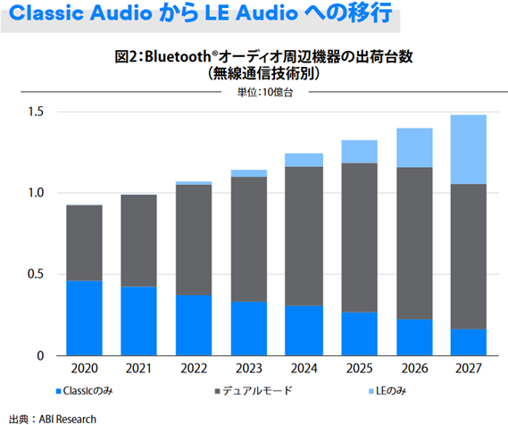

# 2023-1226.md

## 2023/12/26 Windows 11 23H2 更新とLE Audio

インターフェース誌連絡記事で、Windows 11 23H2の下記追加機能をまとめていると気になる項目に気付いた。

## LE Audio

?WT.mc_id=WDIT-MVP-35878
https://learn.microsoft.com/ja-jp/windows-hardware/drivers/what-s-new-in-driver-development

に掲載の、Bluetooth 低エネルギー (LE) オーディオ の機能である。
詳細は下記、Bluetooth Low Energy (LE) オーディオを参照せよとある。

https://learn.microsoft.com/ja-jp/windows-hardware/drivers/bluetooth/bluetooth-low-energy-audio

そして本家、Bluetooth SIG(https://www.bluetooth.com/) による LE Audioのページが以下だ。

https://www.bluetooth.com/learn-about-bluetooth/feature-enhancements/le-audio/

LE Audio は 20 年間の革新により、Bluetooth オーディオ性能を強化、補聴器サポートの追加、オーディオ体験とネットワーク接続方法を変える新しい Auracast のブロードキャストを導入するとある。
新しい用語や概念がいくつか現れる。

https://www.bluetooth.com/wp-content/uploads/2022/11/2210_LE_Audio_NOTE_JP1122.pdf
https://www.bluetooth.com/wp-content/uploads/2020/03/LE-Audio_FAQ_JPN.pdf

などのPDFには次の様なグラフである。
2023年末の時点でこの通りにLE Audioのデュアルデバイスやホスト環境が揃っているとは思えないので、穏やかではない。

「LE Audio」で調べると Windows PCは当然ながら23H2で対応済、製品の市販され始めた。
パナソニックからすでにスマホ連携の補聴器が4機種市販されている。
ソニーからはワイヤレスヘッドホンとワイヤレスイヤホンが発売済だ。

さらに調べると、詳しくわかり易い 価格.com マガジン の記事を見つけた。
音質や利便性が向上する？ Bluetooth「LE Audio」とは
https://kakakumag.com/av-kaden/?id=19819

必要な情報はほぼすべてこのページに書いてある。
Bluetooth SIGが公開している米ABI Researchの市場予測。2027年までに「LE Audio」に対応するデバイスの出荷が30億台に到達するという見込みとも記述。

あとはどうやってLE Audioに対応、拡張する機器を作ることが出来るかということである。

おりしも拙連載記事掲載の、インターフェース誌では付属基板では、Bluetooth Classic Audoioの実験が出来る。
CQ出版社の月刊インターフェース2024年1月号（11月25日発売）の、「Bluetoothオーディオ対応ラズパイPico W DACの製作」である。

ラズパイPico W の発売時期を考えると、ハードウェアは丸ごと流用して、LE Audio 化が出来るのかも知れない。
するとLE Audio のTMAP メディアオーディオプロファイルや、新コーデック「LC3」にも対応させることで「Auracast」にも対応出来るのだろうか。
私は様子を見て、待つだけとしたい。

Windows 11 PC で Bluetooth 低エネルギー オーディオがサポートされているかどうかを確認する

https://support.microsoft.com/ja-jp/windows/windows-11-pc-%E3%81%A7-bluetooth-%E4%BD%8E%E3%82%A8%E3%83%8D%E3%83%AB%E3%82%AE%E3%83%BC-%E3%82%AA%E3%83%BC%E3%83%87%E3%82%A3%E3%82%AA%E3%81%8C%E3%82%B5%E3%83%9D%E3%83%BC%E3%83%88%E3%81%95%E3%82%8C%E3%81%A6%E3%81%84%E3%82%8B%E3%81%8B%E3%81%A9%E3%81%86%E3%81%8B%E3%82%92%E7%A2%BA%E8%AA%8D%E3%81%99%E3%82%8B-2b79c085-0353-4467-8306-ebb2657a91de
