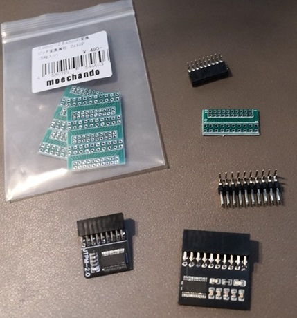
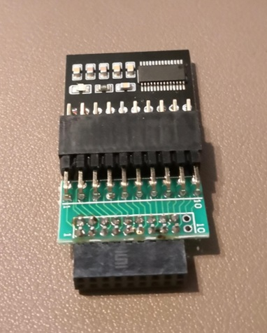
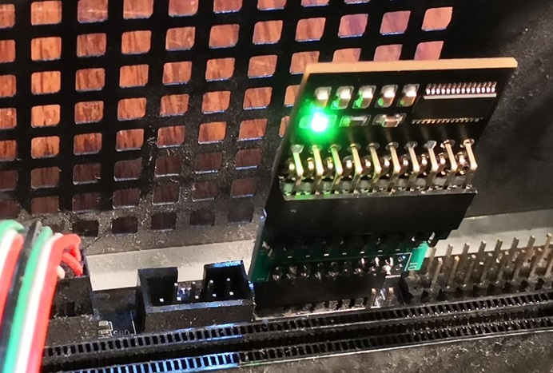
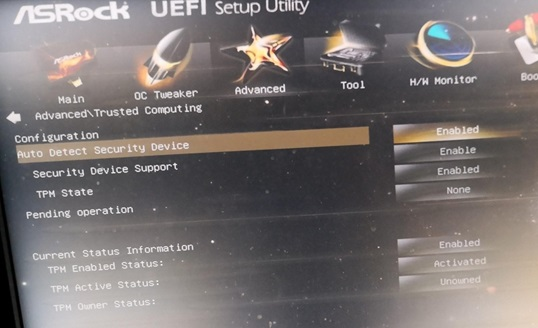

# 2024-0216.md

TPM1.2攻略

過去何回かこのブログ等で指摘して来た「TPMが無いから、古いPCのWindows Insider Preview がインストール出来ない問題」が、思惑通り一部解決した。

結論から言うと、古いPCが備える 2.0mm ピンピッチの TPM 1.2用と推測されるコネクターに、ゲタを自作して、2.54mm ピッチの TPM 1.2 モジュールを接続すると正常に認証されて動作することを確認した。

ご存知ない方のために補足すると、Windows 11やWindows 11 Insider Preview のインストール要件には実質TPM1.2（以上）だけが必要である。

Windows 11 をインストールするその他の方法 (お勧めできません) 

https://support.microsoft.com/ja-jp/windows/windows-11-%E3%82%92%E3%82%A4%E3%83%B3%E3%82%B9%E3%83%88%E3%83%BC%E3%83%AB%E3%81%99%E3%82%8B%E6%96%B9%E6%B3%95-e0edbbfb-cfc5-4011-868b-2ce77ac7c70e

## 適合モジュールの製作手順

使用した部品：

ゲタ製作用変換基板、2.54mm TPM 1.2 モジュール、ライトアングル2mmソケット、ライトアングル2.54mmピン

動作確認したマザーボード ASRock B85M pro4

これらを組み上げたところ

2.54mmピッチソケット装着した様子

BIOSで認識されて、TPM Status が「Activated」に！

## 問題の整理

なぜこんなことをしたのか。問題を整理すると次の通り。

- TPM仕様1.2 と TPM仕様2.0 は互換性が一切無い
- Windows 11 Insider Preview 利用にはTPM装着済マシンが必須だが、一部の旧型マシンは2mmピンピッチのTPMソケットしか備えていない
- 旧型PCのそれらのソケットに市販の2mmピッチTPM2.0モジュールを装着しても多くのTPMが認識されない
- それらの2mmピッチソケットはTPM仕様1.2用と推測されるが市販されておらず入手不可能
- 2.54mm ピンピッチの仕様1.2TPMは多数市販されている

という事で入手した2.54mm ピッチのTPM 1.2モジュールのピンピッチを変換して動作させた
らうまく動作したという事である。

## 背景説明

- Insider Program が4種類になり、22H2/23H2 更新検証を考えるとドライバー開発評価用に正副8台以上の物理マシンが必要
- ドライバー開発用にWindows 11対応マシンを8台揃えるのは厳しい一方で、2mmピッチTPMソケットを持つ余剰マシンが数台あり、有効活用したい。

## 関連YouTubeビデオ

https://www.youtube.com/watch?v=pDWqd0earYA

https://www.youtube.com/watch?v=-NE8SdnLmnU

