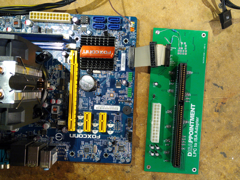

# 2024-0217.md

TPM,Plug and PlayとバスとPC

TPM1.2攻略（2024-0216.md）の続きの逸話である。
先日TPM1.2攻略のビデオを製作して Smart Japan Allieance で披露したところ、
「そのTPMが接続されているバスは何か？」「どの様な規格、ドライバーか？」と質問があった。

「LPCバスなので、PCプラットフォームであればドライバーは不要」と答えると、「LPCバス」とは何か、なぜ「TPM」が「LPCバス」なのかという議論になった。

LPCからISAに変換するボードを製作した事例の記事があった
---

ということで、なぜ「PCIやUSBのTPMが無いかも含めて」少しだけ調べてみた。
仕様間での互換性が無いこと、TPM仕様自体が寄せ集めで、苦し紛れの

以前、Windowsは「互換性の鬼」で、四半世紀前のアプリがそのまま動いたりします。
との紹介をしたが、どっこい(旧IBM-)PCプラットフォーム自体も「互換性の鬼」である。

Windowsは「互換性の鬼」で、四半世紀前のアプリがそのまま動いたりします。
https://forest.watch.impress.co.jp/docs/serial/yajiuma/1557715.html

Broadwell世代までならマザボにISAスロットを追加できる
https://pc.watch.impress.co.jp/docs/news/yajiuma/1499446.html

TPMコネクター（LPC）にISAが接続できる？
https://blog.klovnin.net/archives/1030

Low Pin Count
https://ja.wikipedia.org/wiki/Low_Pin_Count

LPC仕様では7本の信号線が必須であり、双方向のデータ転送を行う。うち4本はアドレスとデータを重畳させて運ぶ。残る3本（フレーム、リセット、クロック）は制御信号用であり、特にリセットとクロックはPCIのPCIRST#およびPCICLKと共通化できる。

仕様にはオプションの6本の信号線が定義されていて、割り込み、DMA、スリープ状態からのシステム起動、電源が切れることをLPC機器に知らせるといった用途に使用できる。

LPCのデータ転送レートは、バスアクセスの種類（I/O、メモリ、DMA、ファームウェア）に依存するが、いずれの場合もISAより若干高速である。33.3MHzでの典型的なI/O転送レートは約2.56Mbyte/sである。 

ここまで簡単に集めた情報を紹介したが、私がやりたい「汎用バスTPM」は鬼の様に古いPCアーキテクチャとBIOSに、ほぼ直付けされている「TPM」のハードウェア構成が原因で、無料なことが分かった。
逆に触られたく無いハードウェアでドライバーだからこそ、TPMは誕生時からの構成を変えていないし、今後も変更しないのだと理解した。 
