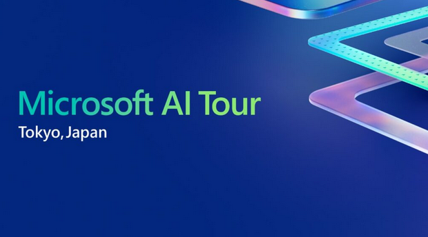
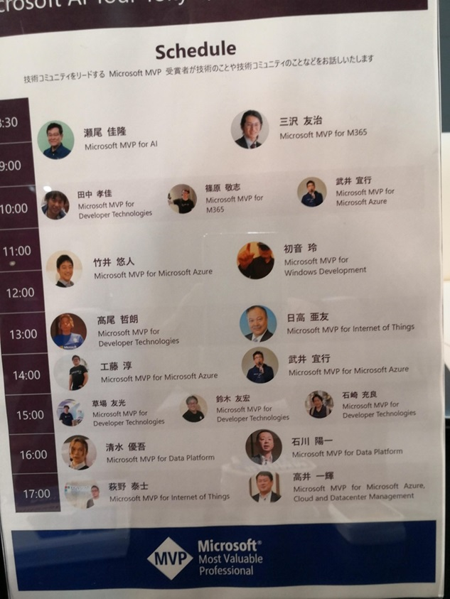
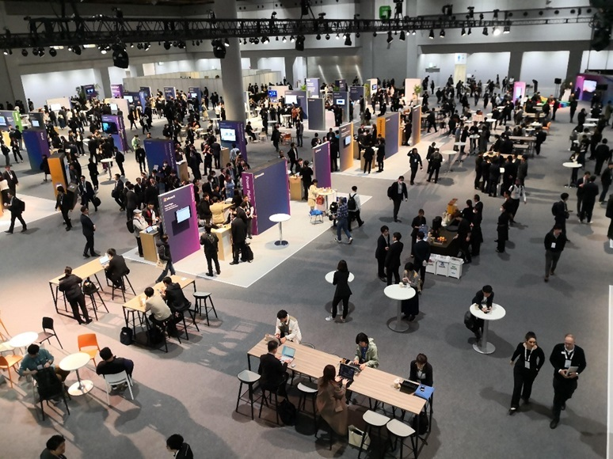
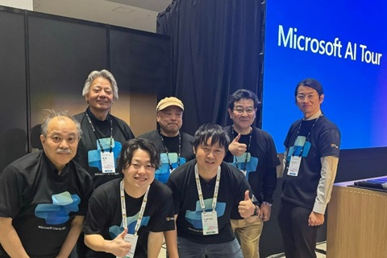
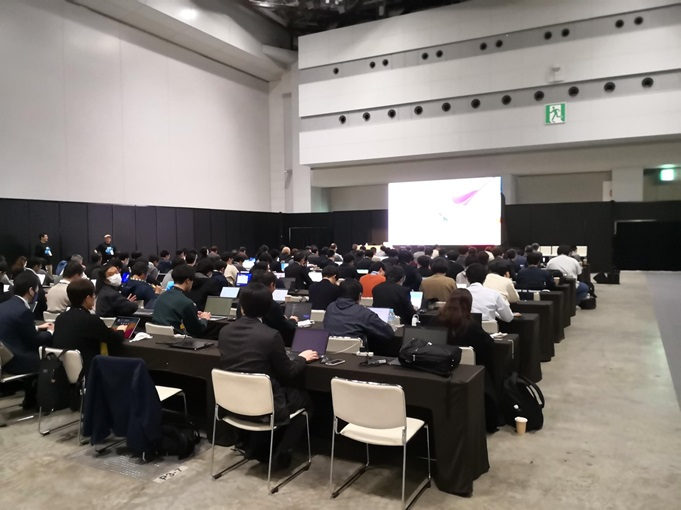

# 2024-0222.md

## Microsoft AI Tour in Tokyo, Japan

2024年 2月 20日 に東京ビッグサイトにて開催された Microsoft AI Tour Tokyo, Japan に参加して来た。
参加者ではあるが、スタッフとしての手伝いもして来た。
手伝い内容は、Microsoft Copilot Studio のWorkshop（ハンズオンラボ）のサポート2回と、Community Lounge Booth Session のスピーカーである。

東京開催で、久しぶりの大規模イベントである。事前打ち合わせ時の情報では、約6,000人の参加者を見込んでいるとのことで、実際にそれぐらいの入場者があったようだ。

Microsoft AI Tour in Tokyo のページ

https://www.microsoft.com/ja-jp/industry/blog/microsoft-in-business/2023/12/21/microsoft-ai-tour-in-tokyo/

https://envision.microsoft.com/ja-JP/tokyo

Community Lounge Booth Session のスケジュールが張り出されていた。
私のセッションは 13:30 から30分間。

Lounge Booth Session を行ったCommunity Hub 南館１階ホールを入口の階段上から見たところ。
午後からは南館は新しく建設された様で、今回初めて訪れた。

ワークショップを講師のMicorosoft の吉田さん、増田さんとサポートスタッフのMVPでの記念撮影。

18:30 から別会場で開催の、Developer Meet & Greet パーティーの様子。

