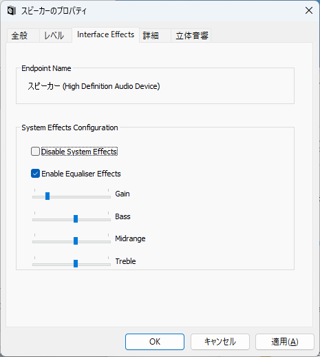

# 2024-0225.md

## Win32 APIの顛末

約1年前、CQ出版インターフェース誌 2023年4月号から、「Windows 11時代のデバイスドライバ開発」の連載が開始した。

http://www.devdrv.co.jp/hidaka/node/98

https://interface.cqpub.co.jp/magazine/202304/

https://interface.cqpub.co.jp/wp-content/uploads/if2304_204.pdf

この連載開始時から抱えていた、正確には連載開始の6年前からのAPOの致命的とも言える課題を紹介する。

大筋は、インターフェース誌2024年4月号記事に書いた通りだが、
コントロールパネルのオーディオ制御GUIが約7年前に廃止となり、後継機能と推測される「設定」パネルのオーディオ制御が使い難いままとなっている点である。

https://interface.cqpub.co.jp/magazine/202404/

問題を整理すると次の通り。
１．コントロールパネルに代わる、「設定」パネルに代わるオーディオ制御機能を一部しか提供出来ていない
２．そのため「設定」パネルのいくつかの機能はコントロールパネルの呼び出しとして実装されている
３．コントロールパネルに代わるカスタムGUI提供方法が用意されていない

参考までに指摘すると、以前はコントロールパネルでのオーディオ制御機能がずっと提供されて来て、APO制御用サンプルコードも公開されていた。
しかし2017年7月7日に突然、その機能していたコントロールパネルのサンプルコードは、GitHub更新から削除されたままである。
そのログが以下である。

 
**Removed property page extention to make Sysvad universal driver.**

2017年7月7日の項である。

補足すると、APOのサンプルコードであるSysVADは、「OnPropertyValueChanged」のレジストリ更新時に呼び出されるコールバックは今でも実装されたままである。
しかし以前のサンプルコードで使われた、コールバック発火（起動側）IPropertyStore::SetValue メソッドは削除されたので、サンプルが無くなった。

詳細は以下に記載されている

IMMNotificationClient::OnPropertyValueChanged メソッド (mmdeviceapi.h)
https://learn.microsoft.com/ja-jp/windows/win32/api/mmdeviceapi/nf-mmdeviceapi-immnotificationclient-onpropertyvaluechanged

**オーディオ エンドポイント デバイスのプロパティの値を正常に変更する IPropertyStore::SetValue メソッドを呼び出すと、 OnPropertyValueChanged への呼び出しが生成されます。 IPropertyStore::SetValue の詳細については、Windows SDKドキュメントを参照してください。**

と記述されているままである。

なおレジストリを手作業等の他の手段で設定しても、「OnPropertyValueChanged」は呼び出されない。
MultiMediaライブラリーをリンクしたIPropertyStore::SetValue メソッドを呼び出した時に、確実に実行される。

ユニバーサルドライバーは Windows 10 で、One Windowsの旗印のもと、様々な形態に分化していた「OS」としてのWindows を一つに再統一する運動であった。
しかしその後、Windows PhoneとWindowows IoT Coreが廃止、残ったWindows 派生商品は Xbox, PixelSense / Surface Hub, Hololens の３種類となった。

しかも最近は UWP / ストアアプリを再構築の流れを汲んで、徐々に、UWPから、(Project Reunion) WinUI 3 への移行が進められている。

話が長くなってしまったが、実は2023年4月号からこの連載が始まった時から、新しいAPOの解説は、来るべき「新オーディオ用UI」で作ろうとと考えていた訳だ。
しかしながら、ご存知の通りWinUI 3 も Windows 11 Widget も 使い易い方向に進化しなかった。
WinUI 3 は今のところ残念ながらC++のサポートが遅れている。 Windows 11 Widget もサンドボックス的な用途の方にだけ熱心に進化して、レジストリやドライバーとのインターフェースは、見捨てられている様子だ。

世の中の動きは各社各様である。
例えば、Equalizer APO 等は独自形式のテキストファイルをパラメータとして持ち、APO側が変更を、「FindNextChangeNotification」関数で監視する様な、独自方式でインターフェースしている。

この方法も検討したが次の問題があることが分かった。
１．「FindNextChangeNotification」の監視は変更を2回以上挙げる場合がある。
２．「FindNextChangeNotification」のは複数イベントを待つためパラメータ変更のピンポイントでの通知では無い
３．いずれ Win UI3 や「設定パネル」でのインターフェース手順が公開されたときに時代遅れになる可能性がある

ということで古い資料やサンプルよく調査したところ、Win32APIによるこのコントロールパネルのダイアログのインターフェースは
約30年前のWindows 95の頃から受け継がれているものだという事が判明した。
スライダーを中心に、当時のサンプルコードを調べたが、Windows 95の頃のWin32 API だけによるWindows アプリは今もVisual Studio 2022で十分に動作することを確認した。
Visual Studio 2022 の明確なサポートこそ無いが、カスタムコントロールのリアルタイム編集などは今でも使えて、実際にコントロールパネルに組込んで動作する。

鬼の様な互換性とはよく言ったものだと今更の様に思う。
（記事参照）

https://forest.watch.impress.co.jp/docs/serial/yajiuma/1557715.html

この記事には、「古すぎる機能」には、Windowsは「互換性の鬼」で、四半世紀前のアプリがそのまま動いたりします。
しかし、そうした互換性維持の努力は、少なからずデメリットも生んでいます。と記述されているが、まだまだ甘い。
30年前の、WIndows 95の流儀のダイアログを、そのまま動かすことが出来た訳だ。

そして作ったのが次のダイアログである。

